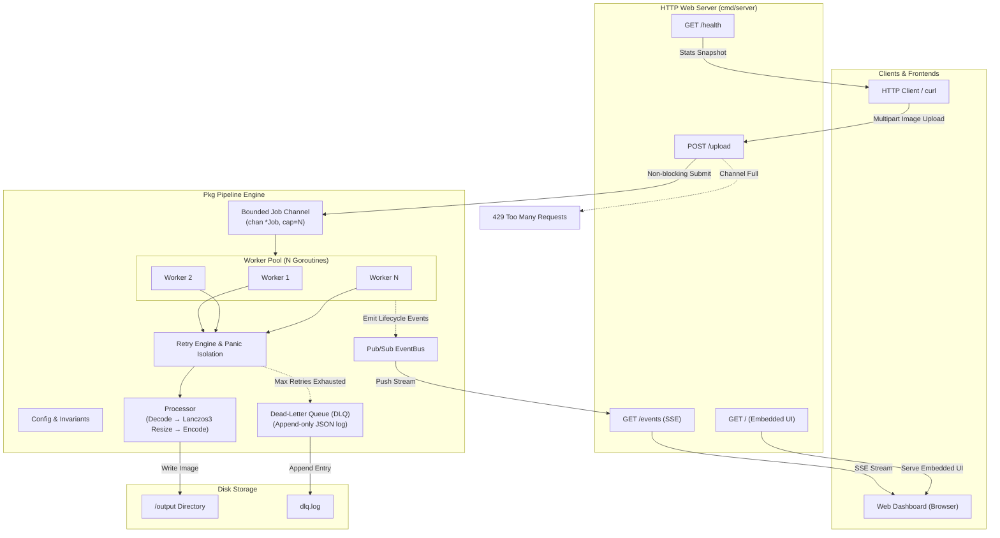
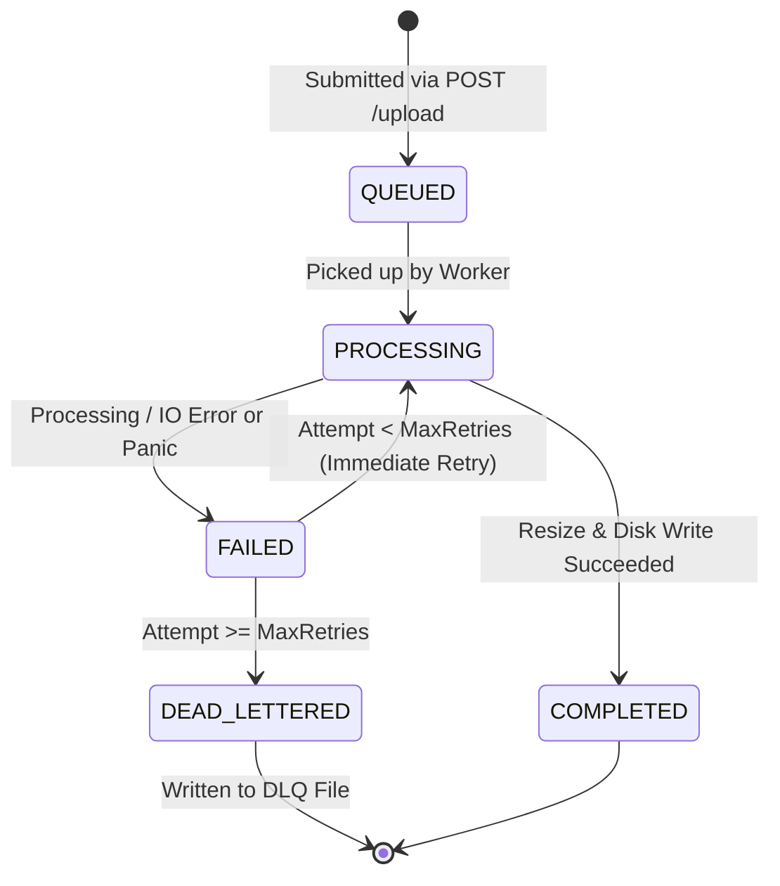
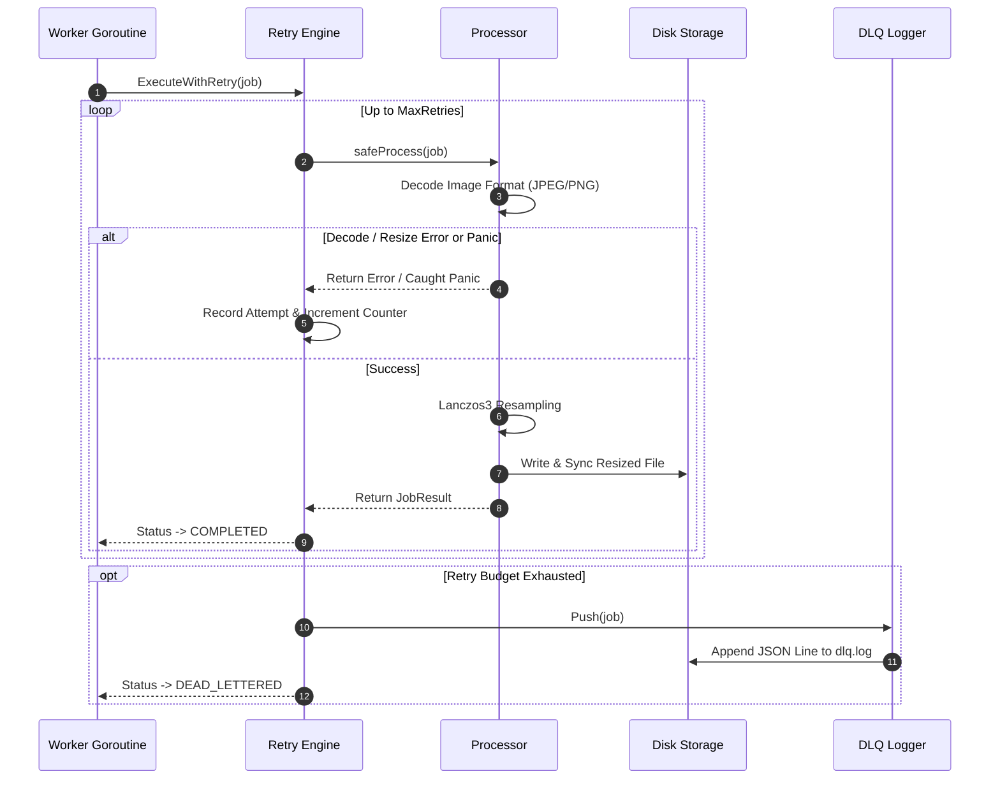

# Bounded Concurrent Image Processing Pipeline

A high-performance, production-ready Go server for async image resize operations. Built with a worker pool concurrency model, backpressure handling, panic isolation, dead-letter queuing (DLQ), and a real-time Server-Sent Events (SSE) web dashboard.

---

## Architecture Overview

The system is designed around a producer-consumer model where HTTP requests submit resize tasks into a bounded channel buffer. A fixed pool of worker goroutines consumes jobs asynchronously, executes image resampling using Lanczos3 interpolation, writes output to disk, and broadcasts state updates to connected clients over SSE.



---

## Detailed Architecture & System Components

### 1. HTTP Ingestion Layer (`cmd/server/main.go`)

- **Multipart Processing**: The `POST /upload` handler enforces `MaxUploadSize` via `http.MaxBytesReader` to guard against memory exhaustion from oversized payloads.
- **Monotonic Job Identification**: Assigns unique sequential identifiers using thread-safe `atomic.Int64` counters.
- **Non-Blocking Enqueue & Backpressure**: Submits constructed `Job` structs to the worker pool. If the bounded channel is full, the server immediately rejects the request with HTTP `429 Too Many Requests`, protecting memory boundaries.
- **Graceful Shutdown**: Intercepts `SIGINT` / `SIGTERM` OS signals via `signal.NotifyContext`. Rejects incoming requests with `503 Service Unavailable`, stops accepting new jobs, flushes HTTP connections, and waits for worker goroutines to complete in-flight tasks within a configurable timeout.

---

### 2. Concurrency Model & Worker Pool (`pkg/pipeline/pool.go` & `job.go`)

- **Fixed-Size Worker Pool**: Spawns `WorkerCount` goroutines that consume jobs sequentially from the bounded Go channel (`chan *Job`).
- **Thread-Safe Job State**:
  - Immutable metadata (`ID`, `FileName`, `TargetWidth`, `TargetHeight`, `FileHeader`) is set at construction and read without locks.
  - Lifecycle state (`Status`) is accessed via `atomic.Int32` for lock-free reads during status monitoring.
  - Mutable execution telemetry (`Attempts`, `LastError`, `Result`) is guarded by a `sync.Mutex`.
- **Atomic Telemetry**: Tracks pool metrics (`activeWorkers`, `totalJobs`, `completedJobs`, `dlqJobs`) using atomic integer operations for low-overhead real-time telemetry.

---

### 3. Job Lifecycle & State Transitions

Jobs follow monotonic forward state transitions:



| Job Status | Description |
| :--- | :--- |
| `QUEUED` | Job created and waiting in bounded channel buffer. |
| `PROCESSING` | Worker has dequeued job and initiated resize attempt. |
| `COMPLETED` | Image resized and saved to output directory successfully. |
| `FAILED` | Attempt encountered an error/panic; eligible for retry. |
| `DEAD_LETTERED` | All retry attempts exhausted; record appended to DLQ log. |

---

### 4. Resampling Engine & Panic Isolation (`pkg/pipeline/processor.go` & `retries.go`)



- **Resampling Quality**: Downsamples images using Lanczos3 high-fidelity interpolation provided by `github.com/nfnt/resize`.
- **Panic Guarding**: `safeProcess` wraps image decoding and resizing inside a `recover()` block. If a corrupted image payload causes a panic, the error is isolated to that specific job attempt without terminating the worker thread or server process.
- **Disk Integrity**: Uses `os.File.Sync()` to flush buffered writes to stable storage before marking jobs completed, with cleanup routines to purge partial files on write errors.

---

### 5. Dead-Letter Queue (DLQ) (`pkg/pipeline/retries.go`)

Jobs that exhaust all retry attempts are formatted into structured JSON entries (`DLQEntry`) and written to an append-only file (`dlq.log`):

```json
{
  "job_id": "42",
  "file_name": "banner.png",
  "attempts": 3,
  "last_error": "decode image \"banner.png\": image: unknown format",
  "target_width": 800,
  "target_height": 600,
  "created_at": "2026-07-29T21:30:00Z",
  "dead_at": "2026-07-29T21:30:02Z"
}
```

---

### 6. Event Bus & Real-Time Dashboard (`pkg/pipeline/events.go` & `web/`)

- **Thread-Safe Pub/Sub**: The `EventBus` broadcasts lifecycle events (`job_queued`, `job_processing`, `job_completed`, `job_dead_lettered`, `backpressure`, `pool_stats`) to registered channels.
- **Non-Blocking Fan-Out**: Uses non-blocking channel sends (`select default`) so slow SSE clients never block worker execution paths.
- **Server-Sent Events (`/events`)**: Streams pipeline events in real time to the browser UI with automated 500ms ticker updates for live capacity gauges.
- **Embedded Web UI**: Static assets (`index.html`, `app.js`, `style.css`) are compiled directly into the Go binary using `go:embed`.

---

## Directory & File Structure

```
.
├── Dockerfile                  # Multi-stage container build definition
├── README.md                   # System architecture & usage documentation
├── cmd/
│   └── server/
│       └── main.go             # Entry point, HTTP router, flag parsing, signal handling
├── go.mod                      # Module requirements & dependencies
├── go.sum                      # Dependency checksums
├── pkg/
│   └── pipeline/
│       ├── config.go           # Pipeline configuration struct & validation rules
│       ├── events.go           # EventBus pub/sub hub & event structures
│       ├── job.go              # Job struct, status enum, atomic state management
│       ├── pipeline_test.go    # Unit, integration, and concurrency benchmark tests
│       ├── pool.go             # Worker pool management & job dispatching
│       ├── processor.go        # Image decode, Lanczos3 resize, and disk writer
│       └── retries.go          # Retry engine, panic isolation, and DLQ writer
└── web/
    ├── app.js                  # Frontend dashboard logic & SSE client connection
    ├── embed.go                # Go embed directive binding static assets
    ├── index.html              # Real-time monitoring web dashboard layout
    └── style.css               # Dashboard styling rules
```

---

## Configuration & CLI Flags

The server binary accepts command-line flags to tune concurrency, buffer capacities, and timeouts:

| Flag | Type | Default | Description |
| :--- | :--- | :--- | :--- |
| `-workers` | `int` | `4` | Number of concurrent worker goroutines |
| `-queue` | `int` | `64` | Capacity of bounded job channel buffer |
| `-output` | `string` | `"./output"` | Directory path for saving resized images |
| `-retries` | `int` | `3` | Max processing attempts before moving job to DLQ |
| `-shutdown-timeout` | `duration` | `10s` | Maximum wait duration for graceful shutdown |
| `-dlq` | `string` | `"./dlq.log"` | File path for append-only dead-letter log |
| `-addr` | `string` | `":8080"` | HTTP server listening address |
| `-max-upload` | `int64` | `33554432` | Maximum upload size in bytes (32 MiB default) |

---

## API Endpoints

### 1. Submit Image Processing Job
- **Endpoint**: `POST /upload`
- **Content-Type**: `multipart/form-data`
- **Parameters**:
  - `image`: Image file binary (`PNG`, `JPEG`, `GIF`)
  - `width`: Desired width in pixels (uint)
  - `height`: Desired height in pixels (uint)
- **Response `202 Accepted`**:
  ```json
  {
    "job_id": "1",
    "message": "job accepted for processing",
    "status": "queued"
  }
  ```
- **Error Responses**:
  - `400 Bad Request`: Missing/invalid fields or non-positive dimensions.
  - `413 Payload Too Large`: Upload payload exceeds `-max-upload`.
  - `429 Too Many Requests`: Job queue buffer is full (Backpressure).
  - `503 Service Unavailable`: Server is in graceful shutdown mode.

---

### 2. Real-Time Event Stream (SSE)
- **Endpoint**: `GET /events`
- **Headers**: `Accept: text/event-stream`
- **Emitted Event Types**:
  - `init` / `pool_stats`: Real-time queue length, active workers, and job counters.
  - `job_queued`: Dispatched when a job is enqueued.
  - `job_processing`: Dispatched when a worker claims a job.
  - `job_completed`: Dispatched when a job finishes resizing.
  - `job_dead_lettered`: Dispatched when a job exhausts all retries.
  - `backpressure`: Dispatched when an upload is rejected due to full queue.

---

### 3. Server Health Probe
- **Endpoint**: `GET /health`
- **Response `200 OK`**:
  ```json
  {
    "status": "ok",
    "queue_len": 0,
    "queue_cap": 64,
    "workers": 4,
    "active_workers": 0,
    "total_jobs": 12,
    "completed_jobs": 12,
    "dlq_jobs": 0
  }
  ```

---

### 4. Web Dashboard
- **Endpoint**: `GET /`
- **Description**: Serves the embedded single-page monitoring dashboard UI showing real-time metrics, queue utilization gauge, and live event feed.

---

## Quickstart & Local Setup

### Prerequisites
- [Go 1.22+](https://go.dev/dl/) (or Docker)

### 1. Running Locally
```bash
# Clone the repository and run the server
go run ./cmd/server -workers=4 -queue=64 -addr=:8080
```
Access the dashboard at `http://localhost:8080`.

### 2. Submitting a Sample Image via `curl`
```bash
curl -X POST http://localhost:8080/upload \
  -F "image=@sample.png" \
  -F "width=300" \
  -F "height=300"
```

### 3. Running Unit & Integration Tests
```bash
# Run all tests with verbose output
go test -v ./...

# Run race detector
go test -race ./...
```

### 4. Containerized Deployment (Docker)
```bash
# Build Docker image
docker build -t image-pipeline:latest .

# Run container
docker run -p 8080:8080 image-pipeline:latest
```
